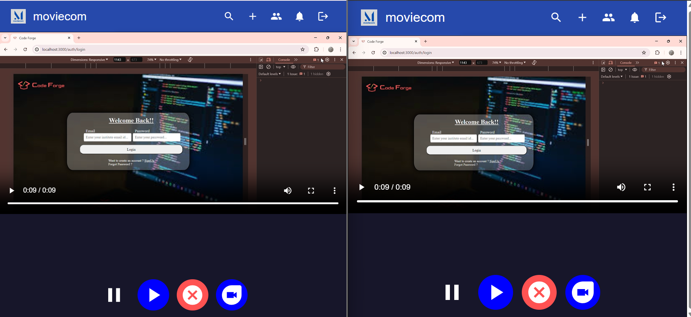
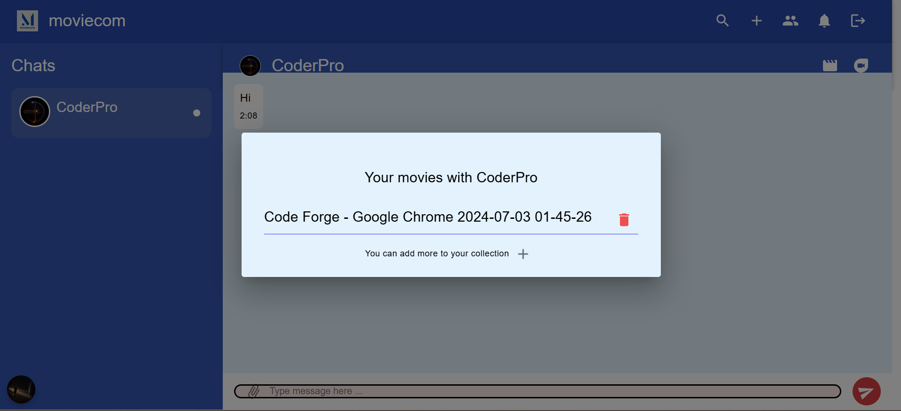
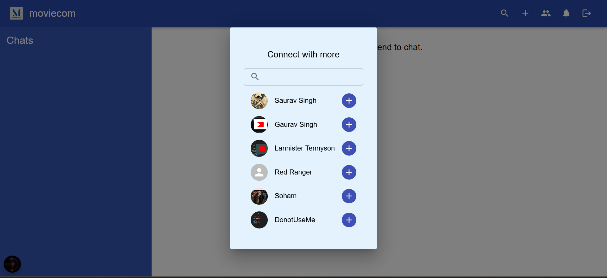
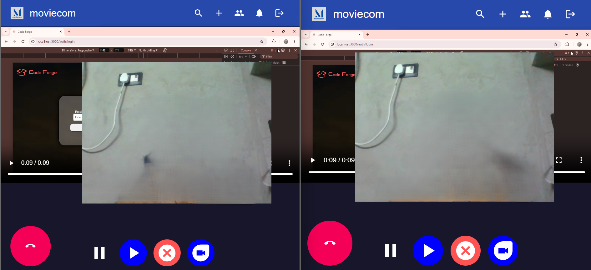
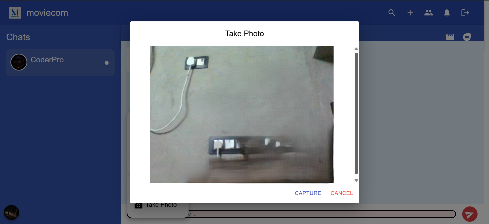

# 🎬 ✅ Moviecom – Watch. Call. Chat. Together.

**Moviecom** is a full-featured, real-time web application that lets users **video call**, **watch movies together**, and **chat simultaneously** — all in one seamless interface. It combines the best of chat apps and streaming platforms, delivering an engaging and interactive experience.

At first glance, it may appear as a regular **Chat App**, but it’s far more powerful:
- Send messages, images, videos, and documents
- Create group chats and manage your profile
- End-to-end encrypted messaging with encrypted storage
- Real-time video calls with friends
- **Synchronized movie playback** between connected users — play, pause, and stop at the same time!

This project is a culmination of everything I’ve learned in web development so far. Built with modern tools, it’s functional, real-time, and creative — though not yet scalable for mass usage.

> 🧠 *Fun Fact*: I built this secretly and was excited to share it — only to realize similar ideas already exist. 😅

---

## 🚀 Live Demo

🔗 [Moviecom](https://moviecom-client.vercel.app)  
🖥️ **Client Repo**: [moviecom-client](https://github.com/sauravatgithub-web/moviecom-client)

---

## 📷 Screenshots









---

## 🛠️ Tech Stack

### 📦 Frontend
- **React.js** – Component-based UI
- **Material-UI (MUI)** – Pre-built components and icons
- **CSS (Inline Styling)** – Responsive design and layout
- **React Router** – Page routing
- **React Toastify** – Notifications
- **React Player** – Video streaming

### 🔧 Backend *(Separate Repo)*
- **Node.js** + **Express.js** – API & WebSocket server
- **Socket.IO** – Real-time communication (chat, call, sync playback)
- **MongoDB + Mongoose** – Database for storing users, messages, and groups
- **Cloudinary** – Media storage (images, videos, documents)

### 🖌️ Design
- **Canva** – Custom icons and UI elements

---

## 📂 Available Scripts

To run the project locally:

### Client
```bash
cd moviecom-client
npm install
npm run dev
```

### Server
```bash
cd moviecom-server
npm install
npm start
```

## 🧠 Key Highlights

🔒 End-to-End Encrypted Chat  
📹 WebRTC-based Video Calling  
🎬 Synchronized Movie Watching (pause/play/seek)  
📤 File & Media Sharing via Cloudinary  
🎨 Custom UI components & icons  
🧾 Self-written password hashing  
🧱 Modular file structure and scalable code  
📱 Fully Responsive Design for Mobile and Tablet Devices  


---

## ⚙️ CI/CD Integration

- ✅ **Frontend Deployed on Vercel** – Auto deploys on push to `main` branch
- ✅ **Backend Deployed on Render** – Persistent backend service with WebSocket support
- 🔁 Planned GitHub Actions:
  - 🧪 Automated Testing Workflow
  - 🧹 ESLint & Code Formatting Checks
  - 🚀 Continuous Deployment Triggers

---

## 👥 Contributors

Built independently and secretly 😄
Learned about similar apps after building it!

> Want to contribute? Fork the repo and open a pull request!

---

## 🙏 Acknowledgements
- **React**, **Socket.IO**, **Cloudinary**, **MUI** – Essential tools for building
- **Canva** – Custom-designed UI assets and icons
- **Open Source Community** – Endless guidance and learning

⭐ If you found this project interesting, leave a star, give feedback, or contribute!
